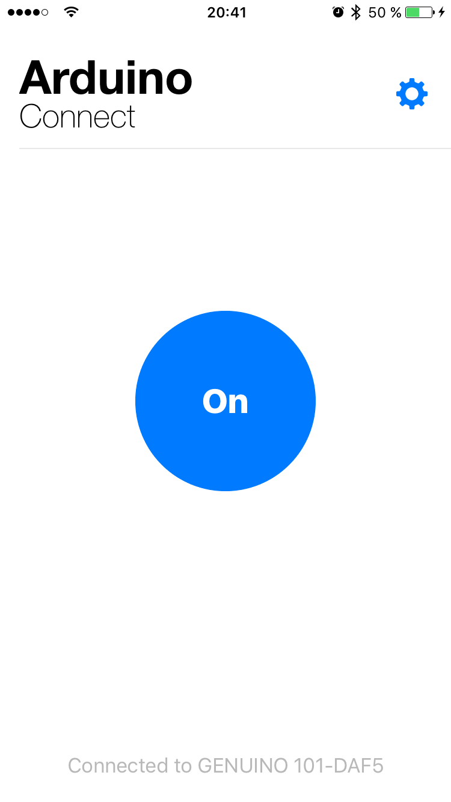

# QuickBLE

[](https://twitter.com/mkoehnke)
[](http://cocoadocs.org/docsets/QuickBLE)
[](https://github.com/Carthage/Carthage)
[](https://github.com/apple/swift-package-manager)
[](http://cocoadocs.org/docsets/QuickBLE)
[](http://cocoadocs.org/docsets/QuickBLE)


A simple wrapper for CoreBluetooth to easily connect to Bluetooth LE devices and read/write it's values. It is **not intended as a fully-featured library**. You can **consider it as a simple prototyping tool** to get a connection to your device up and running quickly.


Take a look at the iOS demo in the `Example` directory to see how to use it. It shows how to turn on/off the LED of an **[Arduino 101](https://www.arduino.cc/en/Main/ArduinoBoard101)**. 




# Usage

QuickBLE has **only a four methods** to connect and manipulate the values of a connected peripheral:

## Initialization

This static function returns an initialized QuickBLE object and starts the service discovery / connection:

```swift
class func start(service: String, delegate: QuickBLEDelegate?) -> QuickBLE
```

#### Example

```swift
helper = QuickBLE.start(service: "arduino", delegate: self)
```

## Reading a value

This function reads the value of the specified characteristic and calls the passed closure with the result:

```swift
func read<T:CharacteristicValue>(uuid: String, result: @escaping (_ value: T?) -> Void)
```

#### Example

```swift
helper.read(uuid: "led") { (value : Int8?) in
    // evaluate value
}
```

## Writing a value

The following sets a value for the specified characteristic unique identifier:

```swift
func write<T:CharacteristicValue>(value: T, for uuid: String)
```

#### Example

```swift
helper.write(value: Int8(1), for: "led")
```


## Stop

Cancels the connection to the peripheral.

```swift
func stop()
```

#### Example

```swift
helper.stop()
```

# Supported Types

QuickBLE currently supports the following types for characteristic values:

* `String`
* `Int8`

This list can be easily expanded with additional types by implementing the following protocol:

```swift
public protocol CharacteristicValue {
    static func getValue(fromData data: Data?) -> Self?
}
```


# Attributions
* Based on [Hello Bluetooth](https://github.com/nebs/hello-bluetooth) by [Nebojsa Petrovic](https://github.com/nebs)

# License
QuickBLE is available under the MIT license. See the LICENSE file for more info.


# Recent Changes
The release notes can be found [here](https://github.com/mkoehnke/QuickBLE/releases).
